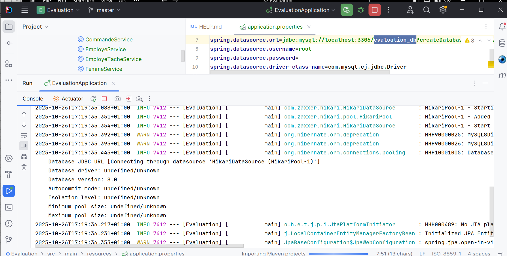

# Evaluation Project

This project implements three distinct management systems using JPA/Hibernate persistence with MySQL database.

## Systems Overview

### 1. Product & Order Management System
- **Entities**: Categorie, Produit, Commande, LigneCommandeProduit
- **Package**: `ma.projet.classes`
- **Services**: CategorieService, ProduitService, CommandeService, LigneCommandeService
- **Features**:
  - List products by category
  - Find products ordered between dates
  - Display order details with products
  - List products with price > 100 DH (using named queries)

### 2. Project Management System
- **Entities**: Employe, Projet, Tache, EmployeTache
- **Package**: `ma.projet.classes`
- **Services**: EmployeService, ProjetService, TacheService, EmployeTacheService
- **Features**:
  - Display tasks completed by an employee
  - Display projects managed by an employee
  - Show planned tasks for a project
  - Show completed tasks with real dates
  - List tasks with price > 1000 DH
  - Find tasks completed between dates

### 3. Citizen & Marriage Management System
- **Entities**: Personne (abstract), Homme, Femme, Mariage
- **Package**: `ma.projet.beans`
- **Services**: HommeService, FemmeService, MariageService
- **Features**:
  - Display wives of a man between dates
  - Count children of a woman between dates (native query)
  - Find women married at least twice (named query)
  - Find men married to 4 women between dates (Criteria API)
  - Display all marriages of a man with details

## Project Structure

```
src/main/java/
├── ma/projet/
│   ├── beans/                 # Marriage system entities
│   │   ├── Personne.java
│   │   ├── Homme.java
│   │   ├── Femme.java
│   │   └── Mariage.java
│   ├── classes/               # Product & Project entities
│   │   ├── Categorie.java
│   │   ├── Produit.java
│   │   ├── Commande.java
│   │   ├── LigneCommandeProduit.java
│   │   ├── Employe.java
│   │   ├── Projet.java
│   │   ├── Tache.java
│   │   └── EmployeTache.java
│   ├── dao/
│   │   └── IDao.java          # Generic DAO interface
│   ├── service/               # Business logic services
│   │   ├── CategorieService.java
│   │   ├── ProduitService.java
│   │   ├── CommandeService.java
│   │   ├── LigneCommandeService.java
│   │   ├── EmployeService.java
│   │   ├── ProjetService.java
│   │   ├── TacheService.java
│   │   ├── EmployeTacheService.java
│   │   ├── HommeService.java
│   │   ├── FemmeService.java
│   │   └── MariageService.java
│   └── util/
│       └── HibernateUtil.java
```

## Prerequisites

- Java 21
- Maven
- MySQL Server

## Database Configuration

Edit `src/main/resources/application.properties` to configure your MySQL connection:

```properties
spring.datasource.url=jdbc:mysql://localhost:3306/evaluation_db?createDatabaseIfNotExist=true&useSSL=false&serverTimezone=UTC
spring.datasource.username=root
spring.datasource.password=your_password
```

## Building the Project

```bash
./mvnw clean compile
# or on Windows
mvnw.cmd clean compile
```

## Running Tests

The project includes three test programs:

1. **ProductOrderTest.java** - Tests the product/order management system
2. **ProjectManagementTest.java** - Tests the project management system  
3. **MarriageTest.java** - Tests the marriage management system

You can run these tests individually from your IDE or by compiling and running them with Java.

## Key Features

### Named Queries
- **Produit**: `Produit.findByPrixGreaterThan` - Find products with price > 100
- **Tache**: `Tache.findByPrixGreaterThan` - Find tasks with price > 1000
- **Femme**: `Femme.marrieesAuMoinsDeuxFois` - Find women married at least twice
- **Mariage**: Native query for counting children between dates

### Advanced Queries
- Join operations for related entities
- Date range queries
- Criteria API for complex queries
- Native SQL queries for specific use cases

## Entity Relationships

### Product Management
- One Categorie → Many Produits
- One Produit → Many LigneCommandeProduit
- One Commande → Many LigneCommandeProduit

### Project Management
- One Employe → Many Projets (as project manager)
- One Projet → Many Taches
- Many-to-Many: Employe ↔ Tache (via EmployeTache)

### Marriage Management
- Homme and Femme extend Personne (inheritance)
- Many-to-Many: Homme ↔ Femme (via Mariage association class)

## Notes

- All entities use JPA annotations (`@Entity`, `@Table`, `@Id`, etc.)
- Inheritance is used for Personne → Homme/Femme
- Association classes resolve many-to-many relationships
- Services implement the generic `IDao` interface
- Database schema is auto-created by Hibernate (`hibernate.hbm2ddl.auto=update`)

# Evaluation

